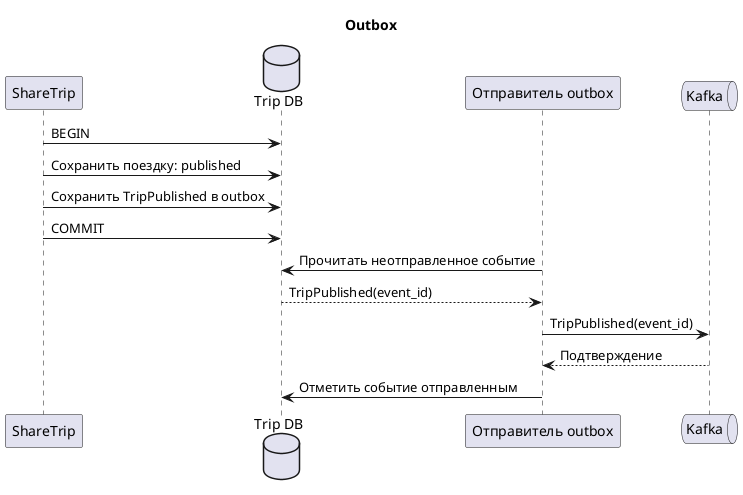
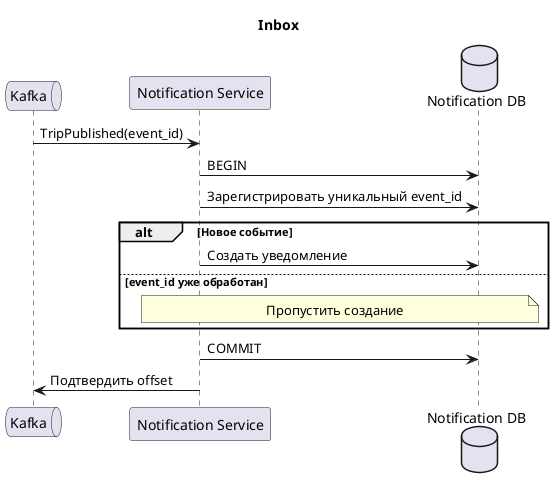
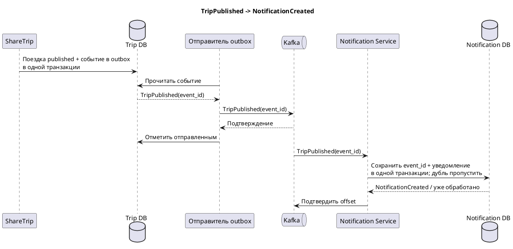

# Консистентность: saga, outbox и inbox

## Двойная запись

ShareTrip сохраняет поездку в своей БД, затем отправляет событие в Kafka.
Это две отдельные записи: транзакция PostgreSQL не охватывает Kafka.

Например, поездка уже получила статус `published`, но перед отправкой события
сервис упал. Поездка опубликована, а Notification Service о ней не узнал.

Сейчас ShareTrip уже сохраняет запись в `outbox_event` вместе с поездкой,
но отправляет событие в Kafka отдельным вызовом после commit.
Отправителя записей из outbox пока нет, поэтому после сбоя доставка не возобновится сама.

## Чтение, запись и retry

- **Чтение** получает информацию: например, проверка доступности `trip_start`
  в Contract Service. Повтор запроса не создаёт нового бизнес-действия.
- **Запись** меняет состояние: например, создание уведомления.
  Повтор без защиты может создать второе уведомление.

Retry — повтор после ошибки — помогает при временной недоступности.
Но если операция выполнена, а ответ потерялся, повтор может продублировать её.
Кроме того, после падения процесса нужно помнить, какое событие осталось отправить.
Для этого нужны outbox и inbox.

## Outbox: не потерять событие

Outbox находится в БД ShareTrip. Поездка и событие сохраняются в одной
транзакции: либо обе записи успешны, либо обе откатываются.
Отдельный отправитель передаёт событие в Kafka и после подтверждения отмечает его отправленным.

Если Kafka недоступна, событие остаётся для следующей попытки.
Сбой после отправки, но до отметки в БД может привести к повторной доставке.
Поэтому при повторах сохраняется тот же `event_id`.

## Inbox: не создать дубль

Inbox находится в БД Notification Service и хранит обработанные `event_id`.
Новый `event_id` и уведомление сохраняются в одной транзакции.
Уникальность `event_id` не позволяет обработать одно событие дважды.
Такая защита уже есть в проекте через `processed_events`.

Offset — позиция обработки сообщения в Kafka — подтверждается после commit.
При ошибке БД транзакция откатывается, offset не подтверждается.
Если сообщение придёт повторно после успешной обработки, сервис пропустит дубль.

## Saga и компенсации

Saga связывает шаги в разных сервисах в один бизнес-процесс.
Если завершить процесс нельзя, выполненные шаги компенсируют новыми действиями.
Например, в ShareTrip можно отменить публикацию поездки. Если позже появятся
оплата и отправка сообщений, компенсациями могут быть возврат денег
и уведомление об отмене поездки.

Компенсация не откатывает чужую транзакцию: это отдельное бизнес-действие.
Временная ошибка создания уведомления сама по себе не требует отмены поездки —
достаточно повторить доставку. Outbox и inbox обеспечивают передачу событий,
а saga определяет шаги процесса и компенсации.

## Общий процесс TripPublished -> NotificationCreated

`NotificationCreated` здесь означает сохранённое уведомление со статусом `created`.
Отдельное событие с таким именем сейчас в Kafka не отправляется.

Уведомление может появиться с задержкой. После восстановления сервисов
и успешных повторов оно будет создано без дублей для того же `event_id`.
