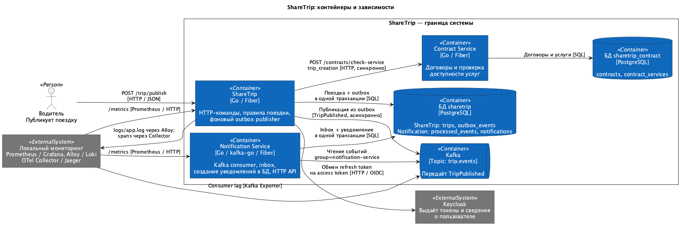
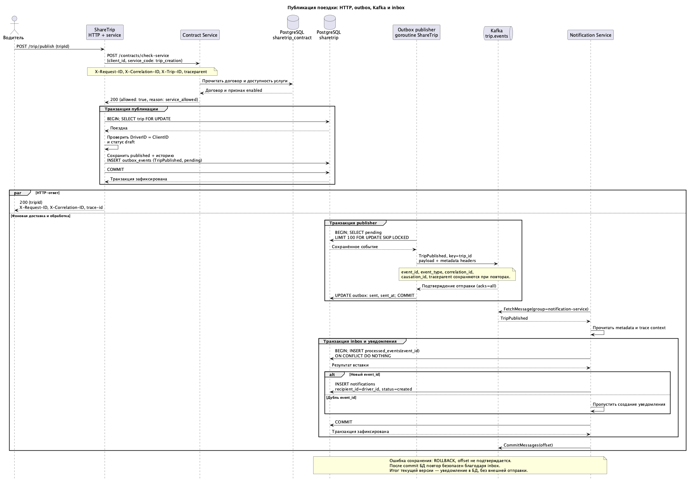

# Архитектурное ревью процесса публикации поездки

## Process overview

Пользователь публикует существующий черновик поездки. ShareTrip проверяет
доступность услуги и право пользователя управлять поездкой, сохраняет публикацию
и событие. Notification Service асинхронно создаёт уведомление водителю.

Успешный сценарий первой публикации:

1. ShareTrip принимает `POST /trip/publish` с `tripId` в JSON-теле.
   Идентификатор пользователя берётся из контекста аутентификации.
2. ShareTrip синхронно вызывает Contract Service через
   `POST /contracts/check-service`, передавая идентификатор пользователя
   как `client_id` и код услуги `trip_creation`. Contract проверяет наличие
   активного договора, срок его действия и доступность услуги; возвращает
   `allowed=true`.
3. ShareTrip открывает транзакцию в своей БД и загружает поездку с блокировкой
   строки. Проверяет, что пользователь является её водителем, а статус — `draft`.
   В одной транзакции переводит поездку в `published` и записывает
   событие `TripPublished` в `outbox_events`.
4. После commit ShareTrip возвращает `200 OK` с `tripId`.
   HTTP-запрос не ждёт отправки события в Kafka или создания уведомления.
5. Outbox publisher работает в фоновой goroutine процесса ShareTrip.
   Он читает сохранённые события и отправляет их в Kafka, в настроенный topic
   (по умолчанию `trip.events`). После подтверждения Kafka отмечает событие
   в outbox как `sent`.
6. Notification Service читает событие из Kafka. Для нового `event_id`
   в одной транзакции сохраняет его в inbox (`processed_events`) и создаёт
   запись в `notifications`: получатель — `driver_id`, тип — `trip_published`,
   статус — `created`.
7. После успешного commit в БД Notification Service подтверждает Kafka offset.

Синхронная граница проходит между ShareTrip и Contract: решение о доступности
услуги требуется до изменения поездки. Асинхронная часть начинается с сохранённого
события в outbox и продолжается через Kafka до Notification. Ответ `200 OK`
подтверждает публикацию поездки и сохранение события, но не готовность уведомления.

В текущей реализации уведомление сохраняется в БД. Отправки в email, SMS или push
нет; статус `created` не означает доставку пользователю.

Основной код ShareTrip: [HTTP-обработчик](../internal/api/move_trip_draft_to_published.go),
[проверка услуги и транзакция](../internal/service/publish_trip.go),
[публикация поездки и запись события](../internal/domain/publish_trip.go),
[outbox publisher](../internal/events/outbox_publisher.go).

## Services

### ShareTrip (`share_trip`)

Владеет агрегатом поездки, её жизненным циклом и событиями в `outbox_events`.
Координирует публикацию: запрашивает решение Contract, сам проверяет принадлежность
поездки водителю и допустимость перехода статуса, сохраняет изменения и событие.
Его фоновый publisher передаёт событие в Kafka. Договорные правила получает через
HTTP API Contract Service.

### Contract Service (`sharetrip-contract`)

Владеет договорами и перечнем доступных по ним услуг: таблицами `contracts`
и `contract_services`. Предоставляет операции создания, подписания и получения
договора, настройки и проверки услуг. В процессе публикации принимает решение
о доступности `trip_creation` для переданного `client_id`.
Принадлежность поездки водителю и её статус проверяет ShareTrip.

Проверка реализована в `sharetrip-contract/internal/service/check_service.go`
и `sharetrip-contract/internal/domain/check_service.go`.

### Notification Service (`sharetrip_notification`)

Владеет уведомлениями (`notifications`) и журналом обработанных событий
(`processed_events`, inbox). Читает `TripPublished`, создаёт уведомление водителю
и распознаёт повторные события по `event_id`. Также предоставляет HTTP API
создания и получения уведомления. В этом сценарии получает данные из события;
вызов Contract Service не выполняется. Внешние каналы доставки не реализованы.

Обработка реализована в `sharetrip_notification/internal/service/handle_trip_published.go`,
атомарное сохранение — в `sharetrip_notification/internal/repository/create_from_event.go`.

## Contracts

### HTTP: ShareTrip → Contract Service

Для публикации используется `POST /contracts/check-service` с
`Content-Type: application/json`. Пример запроса с синтетическим UUID:

```json
{
  "client_id": "550e8400-e29b-41d4-a716-446655440001",
  "service_code": "trip_creation"
}
```

Оба поля обязательны: `client_id` — UUID, `service_code` — непустая строка.
В текущем сценарии ShareTrip передаёт в `client_id` идентификатор пользователя,
публикующего поездку. `trip_id` не входит в тело проверки;
он передаётся в `X-Trip-ID` для диагностики. Также передаются `X-Request-ID`,
`X-Correlation-ID` и `traceparent` при наличии trace context.

Положительное решение — `200 OK`:

```json
{
  "allowed": true,
  "reason": "service_allowed"
}
```

Бизнес-отказ тоже возвращается как `200 OK`, но с `allowed=false` и причиной:
`contract_not_found`, `contract_not_active`, `contract_expired` или
`service_not_allowed`. ShareTrip преобразует такой отказ в `403 Forbidden`
пользователю. Транспортная ошибка, ответ Contract `429` или `5xx` приводят
к `503 Service Unavailable`; неожиданный HTTP-ответ или некорректный JSON
решения — к `502 Bad Gateway`. Во всех этих случаях транзакция публикации
ещё не начата, поездка и outbox не изменяются.

Спецификация: `sharetrip-contract/api/paths/check_service.yaml`.
Потребитель контракта — [CheckService](../internal/contractclient/check_service.go).

### Событие TripPublished: ShareTrip → Kafka → Notification

Topic задаётся через `TRIP_EVENTS_TOPIC`, по умолчанию — `trip.events`.
Notification использует consumer group `notification-service` по умолчанию
(`KAFKA_GROUP_ID`). Kafka message key — `trip_id`; значение — JSON:

| Поле | Тип JSON | Содержание |
| --- | --- | --- |
| `event_id` | string (UUID) | Стабильный идентификатор события; совпадает с `outbox_events.id`. |
| `event_type` | string | `TripPublished`. |
| `trip_id` | string (UUID) | Опубликованная поездка. |
| `driver_id` | string (UUID) | Водитель поездки и получатель уведомления. |
| `company_id` | string (UUID) | В текущем коде заполняется из `ClientID` команды; отдельный ID компании не определяется. |
| `occurred_at` | string (RFC 3339) | Время создания события в UTC. |
| `correlation_id` | string | Идентификатор сквозного процесса. |
| `causation_id` | string | `request_id` HTTP-команды, породившей событие. |
| `traceparent` | string | W3C trace context; без активного контекста может быть пустым. |

`event_id`, `event_type`, `correlation_id`, `causation_id` и `traceparent`
дублируются в Kafka headers. Consumer использует значения headers, если они
присутствуют, поверх полей JSON. Publisher отправляет сохранённое событие:
его ID, время и metadata не пересоздаются при повторной отправке.

Формат задан в [TripPublished](../internal/domain/trip_published.go)
и `sharetrip_notification/internal/events/trip_published.go`;
ключ и headers формирует [Producer](../internal/events/producer.go).

## Consistency

### Outbox: поездка и событие сохраняются вместе

В БД ShareTrip перевод поездки в `published` и вставка `TripPublished`
в `outbox_events` выполняются в одной транзакции. Ошибка до commit откатывает
обе записи. Новое событие получает статус `pending`.

Publisher раз в секунду выбирает до 100 записей `pending` с
`FOR UPDATE SKIP LOCKED`. После подтверждения Kafka сохраняет `sent` и `sent_at`.
При ошибке отправки увеличивает `attempts`, записывает `last_error` и оставляет
`pending` для следующего прохода. Выборка и обновление результатов отправки
выполняются в одной транзакции БД; Kafka в неё не входит. Если событие отправлено,
но commit этой транзакции не состоялся, publisher отправит его повторно.

Ключ идемпотентности — пара `(trip_id, event_type)`. Функция `newEventID`
в [PublishTrip](../internal/domain/publish_trip.go) вычисляет для неё UUID v5
через `uuid.NewSHA1(tripID, []byte(eventType))`. Этот ID сохраняется в outbox
и payload, затем используется Notification для распознавания дублей.
Kafka key `trip_id` выбирает partition, а дедупликация выполняется по `event_id`.

### Inbox: событие и уведомление обрабатываются вместе

В БД Notification поле `processed_events.event_id` — первичный ключ.
`CreateFromEvent` вставляет ID через `ON CONFLICT DO NOTHING` и, только если
он новый, создаёт уведомление в той же транзакции. При повторном ID уведомление
не создаётся. Kafka offset подтверждается после успешного commit, включая
случай распознанного дубля.

Ошибка БД откатывает inbox и уведомление; offset не подтверждается.
Если БД уже зафиксировала результат, а подтверждение offset не удалось,
повторная доставка безопасна благодаря сохранённому `event_id`.
В текущем коде ошибка обработки или подтверждения завершает consumer;
для продолжения обработки требуется перезапуск сервиса.

Таким образом, доставка допускает повторы, а создание уведомления в БД
идемпотентно по `event_id`. Эта гарантия относится к обработке `TripPublished`;
внешней отправки уведомления в текущем процессе нет.

### Какие операции можно повторять

| Операция | Условия и защита |
| --- | --- |
| Проверка `trip_creation` | Читает договорные данные, поэтому повтор безопасен, хотя используется HTTP POST. Клиент повторяет транспортные ошибки `net.Error`, EOF и неожиданный EOF, а также HTTP `429`, `502`, `503`, `504`. Бизнес-отказ не повторяется. |
| `POST /trip/publish` для той же поездки | Проверка Contract выполняется заново. Если она успешна, пользователь — водитель, а поездка уже `published`, API возвращает `204 No Content` без нового события. Блокировка строки защищает от конкурентной публикации. |
| Отправка события из outbox | Использует прежний `event_id` и сохранённые данные. Дубль в Kafka допустим: его распознаёт inbox. |
| Обработка `TripPublished` | Повтор с тем же `event_id` не создаёт второе уведомление благодаря транзакции inbox и уникальному ключу. |

HTTP-повторы ограничены `CONTRACT_SERVICE_RETRY_COUNT` (по умолчанию 2 повтора
после первой попытки) и общим deadline `CONTRACT_SERVICE_TIMEOUT_MS`
(по умолчанию 2000 мс), который включает ожидание и повторы.
Настройка реализована в [Contract client](../internal/contractclient/contract.go).

Между публикацией поездки и созданием уведомления действует eventual consistency:
поездка уже опубликована, а уведомление может появиться позже. Сбой уведомления
не требует отменять публикацию поездки; после восстановления достаточно повторить
доставку или обработку события. Компенсация и отдельная saga для этого сценария
не реализованы и не требуются его текущими бизнес-правилами.

## Runtime

### Deployment и Service

Манифесты трёх приложений находятся в [k8s](../k8s/).
Каждый Deployment задаёт две реплики в namespace `sharetrip` и получает
переменные окружения через `envFrom`:

| Deployment | Образ | ConfigMap | Secret |
| --- | --- | --- | --- |
| `sharetrip` | `sharetrip/sharetrip:local` | `sharetrip-config` | `sharetrip-secret` |
| `contract` | `sharetrip/contract:local` | `contract-config` | `contract-secret` |
| `notification` | `sharetrip/notification:local` | `notification-config` | `notification-secret` |

В текущем каталоге нет манифестов Kubernetes Service ни для одного приложения.
ShareTrip слушает HTTP на `:8080`, Contract — на `:8080`, Notification — на `:8081`.
Адрес `http://contract-service:8080` в конфигурации ShareTrip предполагает
доступный Contract Service, но сам объект Service здесь не описан.
Для чтения Kafka worker-у Notification входящий Service не нужен;
для его HTTP API и сбора `/metrics` нужен доступ к HTTP-порту.

Namespace, образы, PostgreSQL, Kafka и Keycloak должны быть подготовлены отдельно.
Эти манифесты не описывают полное развёртывание системы и её зависимостей.

### ConfigMap и Secret

ConfigMap содержит обычные настройки: HTTP-адреса, параметры подключения к БД
ShareTrip без пароля, адрес Contract и его timeout/retry, Kafka topic/group,
адрес и client ID Keycloak. Contract получает из ConfigMap только `HTTP_ADDR`.

`sharetrip-secret` содержит `DB_PASSWORD` и `KEYCLOAK_CLIENT_SECRET`;
`contract-secret` и `notification-secret` — `DATABASE_URL`.
В репозитории есть только шаблоны `*-secret.example.yaml` с заполнителями.
Рабочие значения нужно задать отдельно, сохраняя файлы с ними вне репозитория.
Перед запуском также требуется заполнить `KEYCLOAK_ISSUER` в ConfigMap.
После изменения ConfigMap или Secret
переменные окружения обновляются при создании новых Pod-ов, поэтому нужен
перезапуск соответствующего Deployment.

Ограничение шаблонов: `notification-secret.example.yaml` указывает БД `sharetrip`,
как и ConfigMap основного сервиса. Раздельная БД для Notification этими примерами
не обеспечивается; фактическая изоляция зависит от рабочих настроек подключения.

### Readiness и liveness

В трёх Deployment отсутствуют `readinessProbe` и `livenessProbe`.
Доступные HTTP-обработчики пока не подключены к Kubernetes probes:

| Приложение | Что реализовано в коде |
| --- | --- |
| ShareTrip | `GET /ready`: проверяет PostgreSQL через `Ping` с timeout 3 секунды; возвращает `200` или `503`. Kafka и Contract эта проверка не охватывает. |
| Contract | `GET /health`: возвращает `200`, без проверки зависимостей. |
| Notification | Отдельных health/readiness endpoints нет; `/metrics` экспортирует метрики. |

Реализация: [ShareTrip ready](../internal/api/ready.go),
`sharetrip-contract/internal/api/route.go`,
`sharetrip_notification/internal/api/register_routes.go`.

## Observability

### Идентификаторы и trace context

| Идентификатор | Назначение и передача |
| --- | --- |
| `request_id` | ID HTTP-запроса: берётся из `X-Request-ID` или генерируется ShareTrip. Возвращается в ответе, передаётся Contract и попадает в контекст логгера. |
| `correlation_id` | Связывает этапы процесса: берётся из `X-Correlation-ID`, по умолчанию равен `request_id`. Проходит через HTTP-заголовок, payload outbox и Kafka headers до логов Notification. |
| `trace_id` | Связывает spans одной трассы. ShareTrip добавляет его в контекст логгера; обработчик публикации возвращает заголовок `trace-id`. Notification извлекает его из `traceparent` и пишет в лог при валидном контексте. |
| `event_id` | Связывает конкретное событие в `outbox_events.id`, payload/headers Kafka, логах Notification и `processed_events.event_id`. Также обеспечивает дедупликацию. |
| `causation_id` | Содержит `request_id` команды, породившей событие; сохраняется в payload, Kafka headers и логах Notification. |

ShareTrip передаёт W3C `traceparent` при вызове Contract и сохраняет его в событии
для Kafka. Собственные HTTP/service/repository spans ShareTrip экспортирует
через OTLP HTTP в `localhost:4319`; адрес сейчас задан в
[main.go](../cmd/sharetrip/main.go). В локальном Docker Compose
[OTel Collector](../otel-collector/config.yaml) пересылает трассы в Jaeger,
UI доступен по `http://localhost:16686`.

Сквозная трассировка реализована частично: Contract получает `traceparent`,
но не извлекает его в OpenTelemetry context и не создаёт spans;
Notification извлекает контекст для логирования, но своих spans не экспортирует.
Передачу metadata можно проследить, однако полная трасса всех трёх сервисов
в Jaeger сейчас не формируется. В Kubernetes адрес `localhost:4319` также
не указывает на отдельный Collector; его запуск рядом с ShareTrip в Pod
текущим Deployment не предусмотрен.

### Логи

ShareTrip пишет JSON-логи в `logs/app.log`; локальный
[Alloy](../alloy/config.alloy) читает этот файл и отправляет записи в Loki.
В Grafana настроен источник Loki. Поля `request_id`, `correlation_id` и
`trace_id` добавляются в логгер запроса, но отдельного access log каждого
HTTP-запроса нет.

Contract и Notification пишут JSON в stdout. Проверку договора можно найти
по `service=contract`, `operation=CheckPermission`, `request_id`,
`correlation_id`, `trip_id` и результату `allowed`, `denied` или `error`.
Обработку события — по `service=notification`, `operation=ConsumeTripPublished`,
`event_id`, `correlation_id`, `causation_id`, `trace_id` и результату обработки.
Текущая конфигурация Alloy не собирает stdout этих двух сервисов.

### Метрики процесса

[Prometheus](../prometheus/prometheus.yml) локально опрашивает ShareTrip
на `host.docker.internal:8080/metrics`, Notification на
`host.docker.internal:8081/metrics`, Kafka Exporter на `kafka-exporter:9308`.
Scrape interval — 10 секунд. Contract не имеет собственного `/metrics`;
его вызовы измеряет клиент в ShareTrip.

| Метрика | Что показывает |
| --- | --- |
| `sharetrip_trip_publish_total{result}` | Результаты команд публикации, включая запреты, ошибки и повторную публикацию. |
| `sharetrip_http_request_duration_seconds{method,path,status}` | Длительность HTTP-запроса; dashboard выбирает `POST /trip/publish`. |
| `sharetrip_contract_request_total{result}` | Завершённые проверки Contract; внутренние retries входят в один вызов. |
| `sharetrip_contract_request_duration_seconds{result}` | Длительность проверки Contract вместе с retries. |
| `sharetrip_outbox_pending_total` | Gauge количества `pending`; обновляется после прохода publisher. При ошибке чтения сохраняет прежнее значение. |
| `sharetrip_outbox_publish_total{result}` | Попытки публикации событий. Успех отправки учитывается до commit статуса outbox. |
| `sharetrip_outbox_publish_failed_total` | Ошибки декодирования outbox payload или отправки в Kafka. |
| `notification_consume_total{result}` | Обработка Kafka messages, включая пропуск других типов; успех учитывается после commit offset. |
| `notification_consume_duration_seconds{result}` | Время обработки сообщения вместе с подтверждением offset. |
| `notification_inbox_duplicate_total` | События, уже присутствующие в inbox. |
| `notification_send_total{result}` | Результаты сохранения уведомления в БД; успех после commit, дубли не учитываются. Внешнюю доставку не измеряет. |
| `kafka_consumergroup_lag` | Отставание consumer group по данным Kafka Exporter. |

Корректный ответ Contract с `allowed=false` считается успешным вызовом
в `sharetrip_contract_request_total`: бизнес-отказ отражается в
`sharetrip_trip_publish_total{result="forbidden"}`.
Идентификаторы запросов и событий используются в логах и трассах,
а не как labels перечисленных метрик.

### Dashboard Trip publication

[Dashboard](../grafana/dashboards/trip-publication.json) автоматически загружается
в папку Grafana `ShareTrip` из файлов. Локальный адрес:
`http://localhost:3000/d/sharetrip-trip-publication`.
Девять панелей показывают:

- частоту публикаций по результатам и долю результатов, отличных от `success`;
- p95 HTTP-публикации и p95 проверки Contract;
- outbox backlog и ошибки отправки за последние 5 минут;
- Kafka consumer lag, дубли inbox за 5 минут и долю ошибок создания уведомлений.

Панель ошибок публикации включает также `forbidden` и `already_published`,
поскольку запрос использует `result!="success"`.
Lag фильтруется по topic `trip.events` и группе `notification-service`;
при изменении этих настроек фильтры dashboard тоже потребуют изменения.
Отсутствие данных (`No data`) не означает нулевой lag или отсутствие ошибок.
Без наблюдений за выбранный интервал p95 также нельзя считать нулевым.

Стек мониторинга описан в [локальном Docker Compose](../deploy/docker-compose.yml).
Его Kubernetes-манифестов и настройки сбора метрик/логов из Pod-ов в `k8s/` нет.

## Failure scenarios

### Contract недоступен

ShareTrip ограничивает проверку общим timeout и допустимыми retries.
Если проверка завершилась ошибкой доступности, пользователь получает `503`
с кодом `CONTRACT_SERVICE_UNAVAILABLE`. Новая транзакция публикации не начинается:
статус поездки не меняется, новое событие в outbox не создаётся.
После восстановления Contract команду можно повторить.

Признаки: HTTP-ответ, `sharetrip_contract_request_total{result="error"}`
и длительность проверки. По `request_id` и `correlation_id` можно искать
связанные записи; если запрос дошёл до Contract — его stdout.
Отдельной записи сетевой ошибки в клиенте Contract сейчас нет, поэтому наличие
идентификатора запроса не гарантирует подробный лог причины сбоя.
Бизнес-отказ `allowed=false` следует отличать от недоступности: он приводит к `403`.

### Kafka недоступна

При работающих Contract и БД ShareTrip поездка публикуется, а событие сохраняется
в outbox; HTTP-запрос не зависит от доступности Kafka. После неудачной отправки
publisher оставляет событие `pending` и, если транзакция записи результата
успешна, сохраняет `attempts` и `last_error`. После восстановления Kafka
publisher повторяет отправку с прежним `event_id`.

Признаки: накопление `pending` при новых публикациях, рост
`sharetrip_outbox_publish_failed_total`, данные `attempts` и `last_error`.
Gauge backlog обновляется после завершения прохода publisher и успешного чтения
БД, поэтому во время зависшей отправки его значение может отставать.
В конфигурации Prometheus нет alert rules: dashboard показывает проблему,
но автоматическое оповещение по backlog или ошибкам не настроено.

### Notification упал

Публикация поездок продолжается. Если обработка остановлена у всех экземпляров
Notification, новые события остаются непрочитанными и consumer lag растёт.
После запуска с прежней consumer group обработка продолжается от сохранённых
offsets, пока необходимые сообщения доступны в Kafka.
Сбой после commit БД, но до commit offset приводит к повторной доставке;
inbox предотвращает создание второго уведомления.

Проверяются stdout процесса, состояние экземпляров, target `notification`
в Prometheus и lag группы `notification-service`. Ошибки обработки сообщения
учитываются в `notification_consume_total{result="error"}`, но при резком падении
процесс может не успеть обновить метрику или отдать её Prometheus.
Некорректный JSON или `event_id` также останавливает consumer:
повторный запуск сам по себе не исправит такое событие.

### Событие доставлено повторно

При том же `event_id` вставка в `processed_events` обнаруживает конфликт ключа.
Notification не создаёт новую запись в `notifications`, увеличивает
`notification_inbox_duplicate_total` и после успешной транзакции подтверждает
offset. `notification_send_total` при распознанном дубле не увеличивается.

Проверка результата — одна запись inbox и одно уведомление для этого `event_id`.
Повторная доставка возможна как после сбоя publisher, так и после сбоя consumer;
сама по себе она не означает повторного бизнес-действия.
Если то же событие отправить с другим `event_id`, текущий inbox сочтёт его новым.

### Уведомление не пришло

Сначала уточняется результат, который поддерживает приложение: запись
`notifications` со статусом `created`. Email, SMS и push текущая версия
не отправляет. Если записи в БД нет, место задержки определяется по состоянию
процесса:

| Наблюдение | Что проверить |
| --- | --- |
| HTTP-публикация завершилась ошибкой | Ответ API и проверку Contract; новая публикация могла не состояться. |
| Поездка опубликована, событие `pending` | Работу publisher, `attempts`, `last_error` и доступность Kafka. `pending` не исключает уже выполненную отправку, если её результат не удалось зафиксировать. |
| Событие `sent`, но inbox отсутствует | Topic, consumer group, Kafka lag, логи и работоспособность Notification. `sent` подтверждает отправку в Kafka, а не обработку consumer-ом. |
| Inbox и уведомление найдены по `event_id` | Обработка в текущей версии завершена; статус `created` не подтверждает внешнюю доставку. |
| Inbox есть, а уведомления нет | Это не нормальная задержка между двумя записями: они сохраняются атомарно. Нужно проверить правильность БД и `event_id`, а также последующие изменения данных. |

HTTP-этапы сопоставляются по `request_id`/`correlation_id`, асинхронные —
по `event_id`, `correlation_id` и `causation_id`. Трасса ShareTrip дополняет
проверку с учётом описанных ограничений tracing. SQL для outbox, inbox
и уведомления приведён в разделе README «Как расследовать: уведомление не пришло».

### Потерян correlation_id

Отсутствие `X-Correlation-ID` в исходном запросе обрабатывается штатно:
ShareTrip использует `request_id`. Если уже назначенный ID потеряется далее
в цепочке, обработка события может продолжиться: consumer не требует непустого
`correlation_id`. Нарушается связь диагностических данных. Для поиска остаются
`event_id`, `causation_id` и `traceparent`; нужно сравнить metadata в outbox,
Kafka payload/headers и логах Notification. Пустой header перезапишет значение
из payload, поэтому важно проверить оба представления события.

## Trade-offs

| Решение | Что даёт | Какую стоимость добавляет |
| --- | --- | --- |
| Отдельные ShareTrip, Contract и Notification | Правила поездки, договора и уведомлений имеют явных владельцев. Сервисы можно развивать и выпускать отдельно при сохранении контрактов. | Три приложения, миграции и конфигурации; изменения API и событий нужно согласовывать между потребителями. |
| Синхронная проверка Contract | Решение о доступности услуги принимается до публикации поездки. | Доступность и latency команды зависят от Contract и сети; нужны deadline, ограниченные retries и понятная ошибка. Проверка договора и изменение поездки не входят в общую транзакцию. |
| Kafka для уведомлений | Работа Notification не блокирует HTTP-публикацию; обработка события может произойти позже. | Eventual consistency, consumer groups, offsets и зависимость от сохранности сообщений в Kafka. |
| Outbox и inbox | Событие сохраняется вместе с поездкой, а повторная доставка не создаёт второе уведомление с тем же `event_id`. | Дополнительные таблицы, транзакции, фоновый publisher, обработка дублей и контроль накопившихся событий. |
| Kubernetes | Для приложений заданы отдельные Deployment и число реплик. | Нужны образы, сетевой доступ, конфигурация и проверки состояния; текущие манифесты покрывают запуск лишь частично. |
| Логи, метрики и tracing | Позволяют сопоставить HTTP-команду, событие и результат обработки. | Нужно поддерживать propagation metadata и отдельный стек мониторинга; неполный сбор логов и spans усложняет расследование. |

В учебном проекте разделение оправдано целью отработать сетевые границы,
асинхронное взаимодействие и восстановление после сбоев. Для самого процесса
оправдан выбор синхронной проверки до изменения поездки и асинхронного создания
уведомления после него. Outbox и inbox обеспечивают необходимые гарантии
при таком разделении.

Для небольшого продукта без требований к независимым релизам и масштабированию
стоимость трёх сервисов, Kafka и Kubernetes может быть избыточной: модульное
приложение позволило бы сохранить границы бизнес-правил с меньшими затратами
на эксплуатацию. Выбор микросервисов для промышленной системы требует
подтверждённой потребности в этой независимости; сам факт разделения кода
не доказывает выигрыша в надёжности или производительности.

## Diagrams

### C4 container diagram

Схема показывает приложения и их зависимости. Подключения к БД соответствуют
текущим примерам конфигурации: ShareTrip и Notification используют БД `sharetrip`,
Contract — `sharetrip_contract`. Владение таблицами остаётся у соответствующих
сервисов. Блоки БД не означают отдельные серверы PostgreSQL.
Мониторинг показан укрупнённо; его связи относятся к локальному Docker Compose.
Граница системы не обозначает готовое развёртывание в Kubernetes.



[Исходник PlantUML](diagrams/microservices-containers.puml)

Outbox publisher входит в процесс ShareTrip. Contract и Notification пишут логи
в stdout; их сбор в Loki не настроен. Внешнего канала доставки уведомлений
на схеме нет, поскольку текущая версия только сохраняет уведомление.

### Sequence diagram публикации поездки

Показана успешная первая публикация после аутентификации через middleware
Keycloak, а также обработка возможного дубля события. После commit поездки
HTTP-ответ и фоновая обработка могут выполняться независимо.
Порядок отправки и обработки ниже — один из возможных: consumer может получить
событие до сохранения статуса `sent` в outbox.



[Исходник PlantUML](diagrams/microservices-publication.puml)

## Проверочный вопрос: расследование за 10 минут

> Если завтра уведомления перестанут приходить, какие данные помогут найти причину за 10 минут?

Для одной проблемной поездки сопоставлю HTTP-результат, логи, метрики, trace
и записи в БД. Порядок первых десяти минут:

1. **0–1 минута: исходный запрос.** Зафиксирую время, `trip_id`, HTTP-статус,
   `X-Request-ID`, `X-Correlation-ID` и `trace-id`, если он есть.
   При ошибке проверю, состоялась ли публикация. При `204` новое событие
   не создаётся: событие первой публикации нужно искать по `trip_id`, поскольку
   его `correlation_id` и `causation_id` могут отличаться от повторного запроса.
2. **1–3 минуты: метрики.** Открою `Trip publication` на интервале сбоя
   и проверю доступность targets в Prometheus. Ошибки Contract проверю через
   `sharetrip_contract_request_total{result="error"}` в Prometheus.
   На dashboard посмотрю p95 вызовов Contract, `sharetrip_outbox_pending_total`,
   `sharetrip_outbox_publish_failed_total`, Kafka consumer lag,
   `notification_inbox_duplicate_total` и ошибки `notification_send_total`.
   Метрики покажут проблемный этап; `No data` потребует проверки сбора данных,
   а не вывода об отсутствии ошибок.
3. **3–5 минут: логи и trace HTTP-этапа.** Найду записи ShareTrip в
   `logs/app.log` или Loki по `request_id`/`correlation_id`, проверку
   `CheckPermission` — в stdout Contract. По `trace_id` открою trace ShareTrip
   в Jaeger и сопоставлю его с логами. Учту, что отдельных spans Contract
   и Notification сейчас нет, как и гарантированного access log каждого запроса.
4. **5–7 минут: outbox.** В БД ShareTrip проверю статус поездки и запись
   `outbox_events` по `aggregate_id=trip_id` и `event_type=TripPublished`.
   Зафиксирую `id` как `event_id`, `status`, `attempts`, `last_error`, `sent_at`
   и metadata из payload. `pending` направляет проверку к publisher и Kafka;
   `sent` подтверждает отправку, но ещё не обработку уведомления.
   Для повторного HTTP-запроса возьму исходные идентификаторы из этого события.
5. **7–8 минут: Kafka.** Найду событие по `event_id` в JSON/headers нужного
   topic, сопоставлю `correlation_id`, `causation_id` и `traceparent` с outbox.
   Проверю `kafka_consumergroup_lag` для фактически настроенной группы
   Notification. Рост lag означает отставание группы, но нулевой lag сам
   по себе не доказывает создания конкретного уведомления.
6. **8–10 минут: Notification и inbox.** В stdout Notification найду
   `ConsumeTripPublished` по тому же `event_id` и `correlation_id`, проверю
   ошибки обработки и commit offset. В его БД сопоставлю
   `processed_events.event_id` и `notifications.payload->>'event_id'`.
   Отсутствие inbox означает, что успешная обработка этого события
   не подтверждена; рост метрики дублей сверю с существующей записью уведомления.
   Наличие уведомления со статусом `created` подтверждает конечный результат
   текущей версии. Ожидание email, SMS или push относится к ещё не реализованной
   внешней доставке.

Готовые SQL-запросы для поездки, outbox, inbox и уведомления находятся в
[инструкции расследования в README](../README.md#как-расследовать-уведомление-не-пришло).
Результат проверки — последний подтверждённый этап, следующий незавершённый
переход и подтверждающие данные: `trip_id`, `event_id`, `correlation_id`,
HTTP-ответ, строки логов, доступный trace, значения метрик и записи в БД.
По ним можно обосновать причину задержки и выбрать восстановление,
описанное в разделе `Failure scenarios`.
